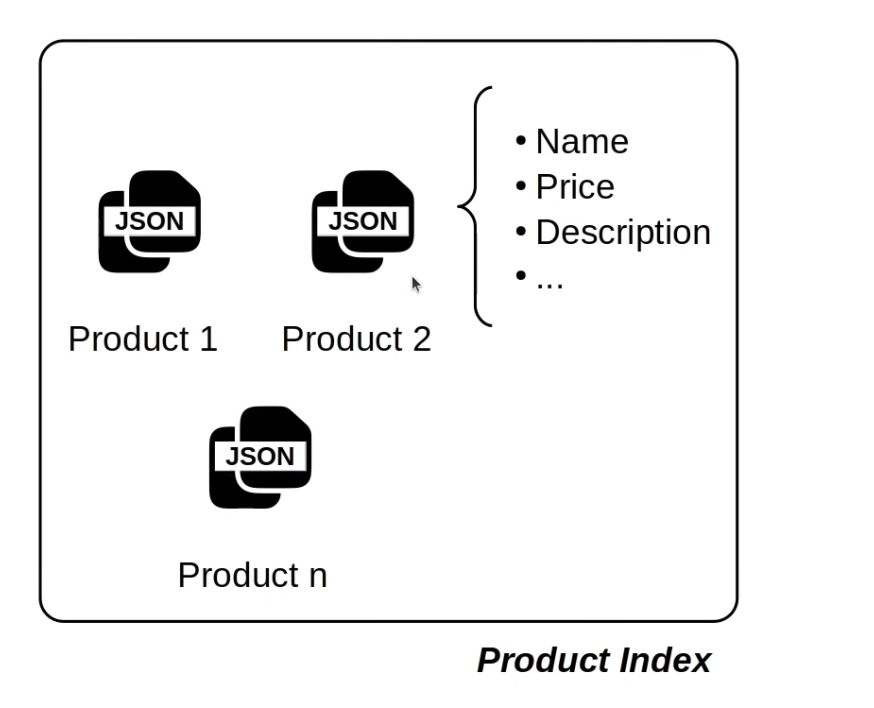
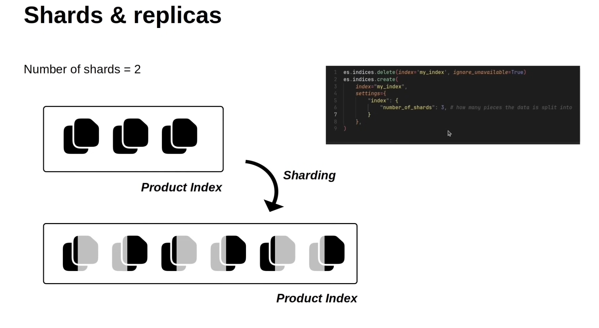
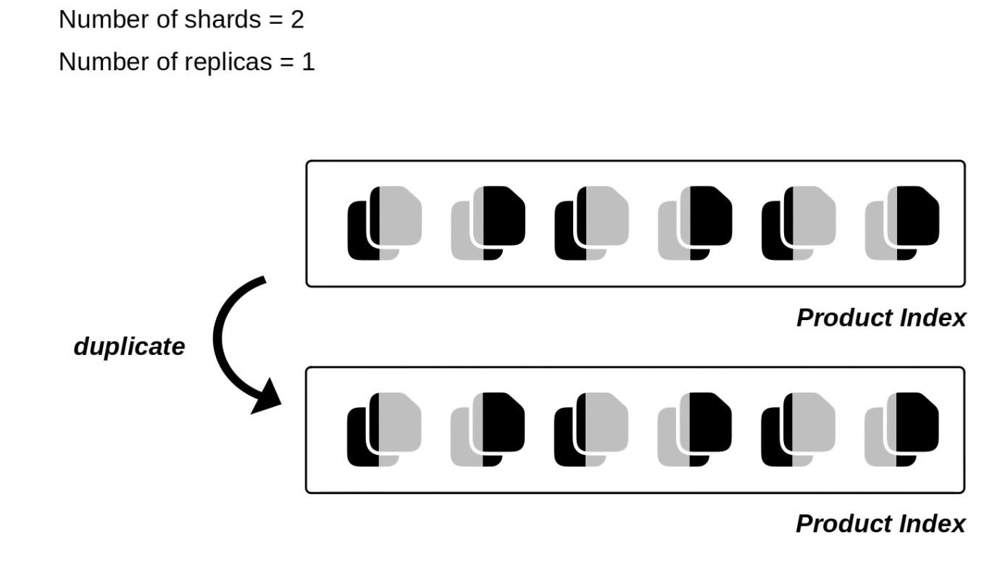
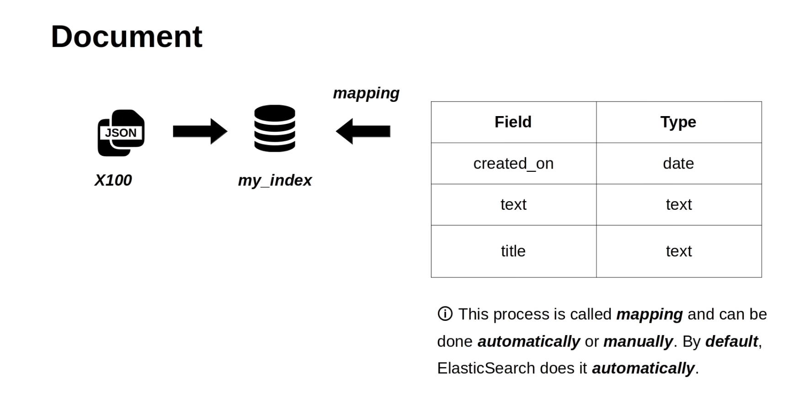
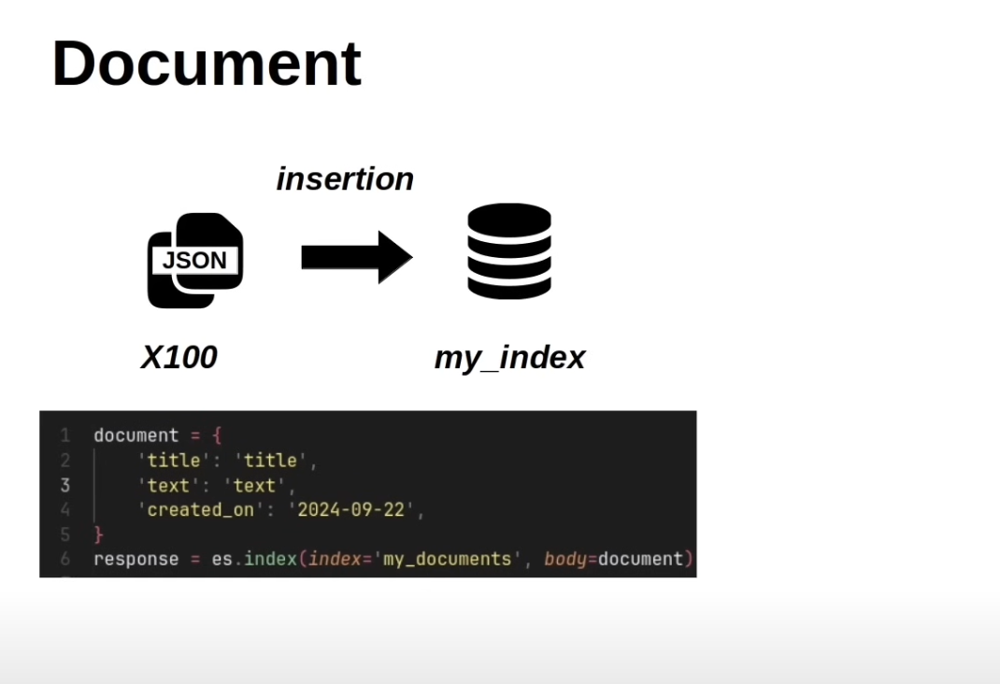

# Elastic Search

## Main concepts

> Index: collection of document that share a characteristic



> Shards & Replicas

- Shards: your document will be split into multi parts
- Replicas: your data will be duplicated





> Document



## Practice

Steps:

### 1. Create an index

```python
    es = Elasticsearch("http://localhost:9200")
    client_info = es.info()
    if es.ping():
        print("Elasticsearch is up!")
        pprint(client_info.body)
        # remove index
        es.options(ignore_status=[400, 404]).indices.delete(
            index="product_index")
        es.indices.create(
            index="product_index",
            settings={
                "number_of_shards": 2,  # how many parts your document will be split into
                "number_of_replicas": 1  # how many copies of your data
            }
        )
        for index in es.cat.indices(format="json"):
            print(
                f"Index: {index['index']}, Shards: {index['pri']}, Replicas: {index['rep']}")
    else:
        print("Elasticsearch is down!")
```

### 2. Insert document



```python
# insert document
document = {
    "name": "Apple iPhone 14 Pro Max",
    "price": 1099,
    "in_stock": True,
    "created_at": "2023-09-01T10:00:00"
}
response = es.index(index="product_index", document=document)
pprint(response)
```

### 3. Mapping


- [Data types](https://www.elastic.co/docs/reference/elasticsearch/mapping-reference/field-data-types)

### 4. Data Types

#### 4.1. Object vs Nested Object vs Flattened Object

```json
{
  "name": "T-Shirt",
  "attributes": [
    { "color": "red", "size": "M" },
    { "color": "blue", "size": "L" }
  ]
}
```

> object mapping

```json
GET products/_search
{
  "query": {
    "bool": {
      "must": [
        { "term": { "attributes.color": "red" } },
        { "term": { "attributes.size": "L" } }
      ]
    }
  }
}

// Returns the product, but it’s wrong.
Because Elasticsearch sees:
"attributes.color": ["red", "blue"],
"attributes.size": ["M", "L"]
So it thinks red exists and L exists → match, even though they are not in the same object.
```

> nested

```json
"attributes": {
  "type": "nested",
  "properties": {
    "color": { "type": "keyword" },
    "size": { "type": "keyword" }
  }
}
GET products/_search
{
  "query": {
    "nested": {
      "path": "attributes",
      "query": {
        "bool": {
          "must": [
            { "term": { "attributes.color": "red" } },
            { "term": { "attributes.size": "L" } }
          ]
        }
      }
    }
  }
}
❌ Returns no product.
Because there’s no object { "color": "red", "size": "L" }.
👉 This is the correct behavior if you need to preserve relationships.
```

> flatten

```json
GET products/_search
{
  "query": {
    "bool": {
      "must": [
        { "term": { "attributes.color": "red" } },
        { "term": { "attributes.size": "L" } }
      ]
    }
  }
}
✅ Returns the product (like object).
But again, it does not respect object boundaries.
Flattened is best when you don’t know all possible keys (dynamic metadata), but you can’t do strict per-object matching.
```

👉 So:

- Use nested when you need precise array-of-object matching.
- Use object/flattened when precision is not required, or when you want speed / schema flexibility.

## References

- [Elasticsearch Course for Beginners](https://www.youtube.com/watch?v=a4HBKEda_F8)
